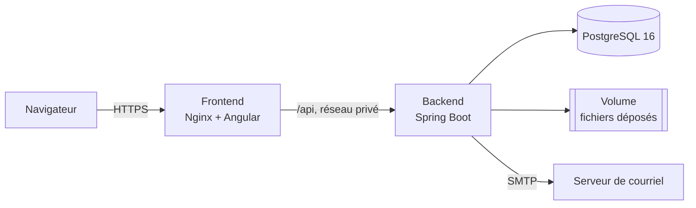

<div align="center">


# Club Informatique de l'IST

Plateforme web du Club Informatique de l'Institut Supérieur de Technologie, Ouagadougou

[](https://github.com/RBonsa404/Ciub_Informatique_IST/actions/workflows/ci.yml)


**[istclubinformatique.up.railway.app](https://istclubinformatique.up.railway.app)**

</div>

---

## Sommaire

- [Présentation](#présentation)
- [Fonctionnalités](#fonctionnalités)
- [Architecture](#architecture)
- [Démarrage rapide](#démarrage-rapide)
- [Variables d'environnement](#variables-denvironnement)
- [Comptes de test](#comptes-de-test)
- [Tests et contrôles qualité](#tests-et-contrôles-qualité)
- [Déploiement](#déploiement)
- [Exploitation](#exploitation)
- [Structure du dépôt](#structure-du-dépôt)
- [Documentation](#documentation)
- [Contact](#contact)

## Présentation

La plateforme réunit le site public du club et son espace de gestion. Les visiteurs y découvrent le club, ses actualités, ses événements et ses formations. Les membres s'inscrivent aux activités, retrouvent leurs supports et proposent des projets. Le bureau publie, organise et administre.

Trois principes guident le projet :

- **Des données réelles uniquement.** Le site n'affiche que ce que renvoie l'API, donc la base. Une donnée absente donne un état vide, jamais une valeur d'exemple. Un contrôle automatique (`npm run check`) le vérifie à chaque construction.
- **Des droits appliqués par le serveur.** Chaque rôle n'accède qu'à ce qui lui revient, ressource par ressource ; l'interface ne fait que masquer ce que le rôle ne peut pas ouvrir.
- **Aucun secret dans le dépôt.** Toute la configuration passe par des variables d'environnement.

## Fonctionnalités

| Espace | Ce qu'on y trouve |
|---|---|
| Site public | accueil, présentation, bureau, actualités, événements, formations, ressources, projets, contact, pages légales ; thèmes clair et sombre ; pages publiques pré-rendues pour l'affichage immédiat et le référencement |
| Membre | profil et photo, inscriptions aux formations et aux événements, supports de cours, devoirs, propositions de projets, notifications |
| Formateur | cours, séances, présences, supports et devoirs |
| Responsable du Club | actualités, événements, bureau, décisions sur les projets, inscriptions, messages de contact |
| Administrateur | comptes et rôles, catégories, textes des pages d'accueil et de présentation, statistiques, sécurité des comptes, journal d'audit |
| Super Admin | configuration du système, sauvegardes |
| DSI | supervision technique et contrôles de conformité |

Sécurité : session par cookie `HttpOnly`, `Secure`, `SameSite=Strict` avec rotation des jetons, vérification de l'adresse électronique, verrouillage après échecs répétés, limitation du débit, en-têtes de sécurité stricts (CSP, HSTS), journal d'audit des opérations sensibles.

## Architecture



| Composant | Technologies |
|---|---|
| Frontend | Angular 22 (sans zone.js), Tailwind CSS 4, pré-rendu des pages publiques, Nginx |
| Backend | Java 17, Spring Boot 3.5, Spring Security, Spring Data JPA, Flyway, JWT |
| Base | PostgreSQL 16 |
| Tests | Vitest, JUnit 5, Testcontainers, Playwright, Lighthouse |
| Intégration continue | GitHub Actions |
| Hébergement | Railway (trois services : base, backend, frontend) |

Le frontend relaie `/api` vers le backend : le site et l'API partagent la même origine, le cookie de session reste de première partie et le backend n'a pas besoin d'être exposé sur Internet.

## Démarrage rapide

### Prérequis

| Outil | Version |
|---|---|
| Java | 17 ou plus récent |
| Maven | 3.9 |
| Node.js et npm | 24 et 11 |
| Docker | récent, avec Docker Compose |

### Lancer le projet en local

```bash
git clone https://github.com/RBonsa404/Ciub_Informatique_IST.git
```

```bash
cd Ciub_Informatique_IST
```

1. Démarrer la base PostgreSQL et Mailpit, qui capture tous les courriels envoyés en local :

   ```bash
   docker compose -f club-informatique-backend/compose.dev.yml up -d
   ```

2. Démarrer le backend dans un premier terminal. Les migrations s'appliquent au démarrage :

   ```bash
   cd club-informatique-backend
   mvn spring-boot:run -Dspring-boot.run.profiles=dev
   ```

3. Démarrer le frontend dans un second terminal :

   ```bash
   cd club-informatique-frontend
   npm ci
   npm start
   ```

| Service | Adresse |
|---|---|
| Site | http://localhost:4200 |
| API | http://localhost:8080/api/v1 |
| Documentation interactive de l'API | http://localhost:8080/api/v1/swagger-ui.html |
| Courriels capturés | http://localhost:8025 |

Les valeurs par défaut du profil `dev` suffisent pour travailler en local. Pour créer un premier compte Super Admin, définir `APP_BOOTSTRAP_ADMIN_EMAIL` et `APP_BOOTSTRAP_ADMIN_PASSWORD` avant de lancer le backend (voir ci-dessous).

## Variables d'environnement

Le fichier [`club-informatique-backend/.env.example`](club-informatique-backend/.env.example) les liste toutes, commentées. Il sert de modèle : le fichier `.env` n'est jamais versionné.

### Backend

| Variable | Production | Description |
|---|:---:|---|
| `SPRING_PROFILES_ACTIVE` | requise | `prod` en ligne, `dev` en local |
| `PORT` | requise | port d'écoute, `8080` |
| `SPRING_DATASOURCE_URL` | requise | `jdbc:postgresql://<hôte>:<port>/<base>` |
| `SPRING_DATASOURCE_USERNAME`, `SPRING_DATASOURCE_PASSWORD` | requises | identifiants de la base |
| `JWT_SECRET` | requise | secret de signature des jetons, 64 caractères aléatoires recommandés |
| `CORS_ALLOWED_ORIGINS` | requise | adresse publique exacte du site ; plusieurs valeurs séparées par des virgules |
| `APP_FRONTEND_URL` | requise | adresse publique du site, utilisée dans les liens des courriels |
| `MAIL_HOST`, `MAIL_PORT` | requises | serveur SMTP |
| `MAIL_USERNAME`, `MAIL_PASSWORD` | selon le fournisseur | identifiants SMTP |
| `MAIL_SMTP_AUTH`, `MAIL_SMTP_STARTTLS` | selon le fournisseur | `true` et `true` chez la plupart des fournisseurs |
| `MAIL_FROM` | requise | adresse d'expédition |
| `CONTACT_EMAIL` | facultative | adresse qui reçoit les messages du formulaire de contact |
| `STORAGE_TYPE` | facultative | `local` (dossier, par défaut) ou `s3` (stockage objet) |
| `UPLOAD_DIR` | avec `local` | dossier des fichiers déposés ; `/app/uploads` en ligne, sur un volume persistant |
| `STORAGE_S3_ENDPOINT`, `STORAGE_S3_REGION`, `STORAGE_S3_BUCKET`, `STORAGE_S3_ACCESS_KEY`, `STORAGE_S3_SECRET_KEY` | avec `s3` | stockage objet compatible S3 |
| `APP_BOOTSTRAP_ADMIN_EMAIL`, `APP_BOOTSTRAP_ADMIN_PASSWORD` | premier démarrage | création du premier Super Admin ; à retirer ensuite |
| `APP_SEED_TEST_ACCOUNTS`, `APP_TEST_ACCOUNTS_PASSWORD`, `APP_PURGE_TEST_ACCOUNTS` | essais seulement | création et retrait des comptes de test du bureau |
| `APP_TRIAL_ACCOUNTS_PASSWORD` | essais seulement | mot de passe des comptes d'essai confiés aux étudiants ; ces comptes ne sont créés que si la variable est renseignée |
| `BCRYPT_STRENGTH` | facultative | coût du hachage des mots de passe, 11 par défaut |
| `DB_POOL_MAX` | facultative | taille du pool de connexions, 10 par défaut |
| `RATE_LIMIT_AUTH_CAPACITY` | facultative | tentatives d'authentification autorisées par fenêtre, 20 par défaut |

### Frontend (image de production)

| Variable | Production | Description |
|---|:---:|---|
| `API_URL` | requise | adresse interne du backend, sans barre finale, par exemple `http://club-backend.railway.internal:8080` |
| `PORT` | fournie par l'hébergeur | port d'écoute de Nginx, `8080` par défaut |

## Comptes de test

Pour la période d'essai, le backend crée deux groupes de comptes au démarrage lorsque `APP_SEED_TEST_ACCOUNTS=true`. Ils sont marqués comme comptes de test, exclus de toutes les statistiques, et se retirent en une seule opération avec tout ce qu'ils ont produit (`APP_PURGE_TEST_ACCOUNTS=true`). Leur domaine, `recette.invalid`, est réservé : aucun courriel ne peut leur parvenir.

### Comptes du bureau

Un compte au nom de chaque membre du bureau exécutif, tous les rôles étant représentés. Mot de passe : valeur de `APP_TEST_ACCOUNTS_PASSWORD`.

| Membre du bureau | Rôle | Identifiant de connexion |
|---|---|---|
| Abdoul Rachid Bonsa | Super Admin et Administrateur | `abdoul-rachid.bonsa@recette.invalid` |
| Prince Pamousso | Administrateur | `prince.pamousso@recette.invalid` |
| Ramatou Sidibé | Responsable du Club | `ramatou.sidibe@recette.invalid` |
| Arnaud Ouare | Formateur | `arnaud.ouare@recette.invalid` |
| Sandrine Ki | Formateur | `sandrine.ki@recette.invalid` |
| Tony Darel Zongo | DSI | `tony-darel.zongo@recette.invalid` |
| Christ Orient Salou | Membre | `christ-orient.salou@recette.invalid` |

### Comptes d'essai pour les étudiants

Quatre comptes de simple membre, à confier aux étudiants invités à essayer la plateforme. Ils n'ont accès qu'à l'espace Membre. Mot de passe : valeur de `APP_TRIAL_ACCOUNTS_PASSWORD`, distincte de celle des comptes du bureau.

| Compte | Rôle | Identifiant de connexion |
|---|---|---|
| Compte Essai 1 | Membre | `essai1@recette.invalid` |
| Compte Essai 2 | Membre | `essai2@recette.invalid` |
| Compte Essai 3 | Membre | `essai3@recette.invalid` |
| Compte Essai 4 | Membre | `essai4@recette.invalid` |

### Mots de passe

Le dépôt est public : les mots de passe n'y figurent pas. Ils sont choisis par le Super Admin dans les variables du service backend sur Railway, puis transmis aux personnes concernées par un canal privé. Pour en changer, modifier la variable et redémarrer le service : les comptes déjà créés gardent leur mot de passe ; il faut d'abord les retirer (`APP_PURGE_TEST_ACCOUNTS=true`) pour qu'ils soient recréés avec le nouveau. Procédure complète : [mise en service, étape 8](docs/mise-en-service.md#8-comptes-de-test).

En local, la pile de recette (`node club-informatique-frontend/e2e/backend-recette.mjs`) crée ces mêmes comptes avec les mots de passe de recette : `Recette@2026` pour le bureau, `Recette@2026-essai` pour les comptes d'essai. Ces valeurs ne valent que pour une base locale.

## Tests et contrôles qualité

| Commande | Dossier | Vérifie |
|---|---|---|
| `mvn verify` | backend | tests unitaires, puis tests d'intégration sur un vrai PostgreSQL (Testcontainers) ; couverture dans `target/site/jacoco/index.html` |
| `npm test` | frontend | tests unitaires (Vitest) |
| `npm run check` | frontend | absence de chiffres écrits en dur dans les gabarits ; casse des noms de fichiers |
| `npm run build` | frontend | construction de production et pré-rendu des pages publiques |
| `node e2e/integration.mjs` | frontend | par module : lecture, refus selon le rôle, erreurs restituées |
| `node e2e/parcours.mjs` | frontend | parcours complets de chaque rôle sur base vierge et image de production |
| `node e2e/lighthouse.mjs` | frontend | performance, accessibilité, bonnes pratiques et référencement des pages publiques |

L'intégration continue ([`.github/workflows/ci.yml`](.github/workflows/ci.yml)) rejoue les contrôles, les tests et les constructions à chaque envoi sur GitHub. Les scripts de recette, la base de test et leurs conteneurs sont décrits dans [`club-informatique-frontend/README.md`](club-informatique-frontend/README.md).

## Déploiement

Le site est hébergé sur Railway, en trois services dans un même projet.

| Service | Dossier racine | Sonde de santé | Exposition |
|---|---|---|---|
| Base PostgreSQL | service géré | | réseau privé |
| `club-backend` | `club-informatique-backend` | `/api/v1/actuator/health/liveness` | réseau privé ; volume sur `/app/uploads` |
| `club-frontend` | `club-informatique-frontend` | `/sante` | domaine public, port `8080` |

Chaque fusion sur `main` redéploie automatiquement les deux services.

| Guide | Contenu |
|---|---|
| [Déploiement](docs/deploiement.md) | création des services, variables, ordre de mise en ligne, vérifications, retour arrière |
| [Mise en service pas à pas](docs/mise-en-service.md) | première connexion du Super Admin, retrait du domaine public du backend, volume, courriels, sauvegarde, comptes de test, dépannage |

## Exploitation

- **Santé** : `GET /api/v1/actuator/health` renvoie `{"status":"UP"}`.
- **Journaux** : en production, une ligne JSON par événement ; chaque requête porte un identifiant renvoyé dans l'en-tête `X-Request-Id`.
- **Sauvegarde** : `club-informatique-backend/scripts/sauvegarde.sh`, au moins une fois par semaine ; restauration par `scripts/restauration.sh`.
- **Premier Super Admin** : aucun compte n'est livré avec l'application. Tant qu'aucun Super Admin n'existe, le démarrage en crée un à partir de `APP_BOOTSTRAP_ADMIN_EMAIL` et `APP_BOOTSTRAP_ADMIN_PASSWORD`. Ce mot de passe doit être changé à la première connexion.
- **Comptes de test** : voir [Comptes de test](#comptes-de-test).
- **Textes du site** : les textes des pages d'accueil et de présentation se modifient dans **Administration → Textes du site** ; ils sont publiés dès l'enregistrement.

Détails : [docs/exploitation.md](docs/exploitation.md).

## Structure du dépôt

```
.
├── club-informatique-backend/    API REST Spring Boot, migrations Flyway, scripts de sauvegarde
├── club-informatique-frontend/   application Angular, configuration Nginx, scripts de recette
├── docs/                         contrat d'API, déploiement, exploitation, décisions, recette
└── .github/workflows/            intégration continue
```

## Documentation

| Document | Sujet |
|---|---|
| [docs/api-contract.openapi.yaml](docs/api-contract.openapi.yaml) | contrat de l'API (OpenAPI 3.1) |
| [docs/deploiement.md](docs/deploiement.md) | déploiement sur Railway |
| [docs/mise-en-service.md](docs/mise-en-service.md) | réglages après la mise en ligne, pas à pas |
| [docs/exploitation.md](docs/exploitation.md) | santé, journaux, tâches planifiées, sauvegarde, restauration |
| [docs/decisions.md](docs/decisions.md) | décisions techniques et arbitrages |
| [docs/performance.md](docs/performance.md) | mesures de performance et réglages |
| [docs/informations-a-fournir.md](docs/informations-a-fournir.md) | informations attendues du club (mentions légales, bureau, partenaires) |
| [docs/recette/](docs/recette/) | journaux de recette, preuve d'intégration, parcours |
| [docs/PROGRESSION.md](docs/PROGRESSION.md) | état d'avancement |

## Contact

Club Informatique de l'IST, Institut Supérieur de Technologie, Ouagadougou, Burkina Faso
Courriel : [clubinformatique.ist@gmail.com](mailto:clubinformatique.ist@gmail.com)
